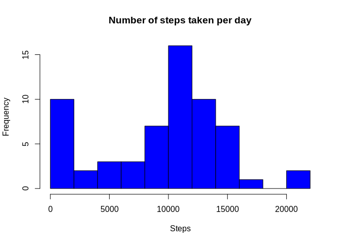
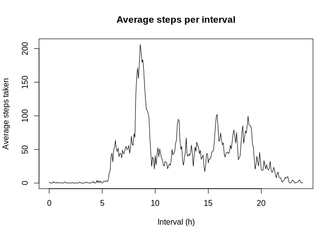
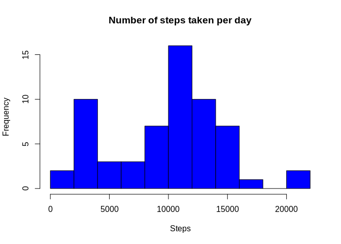
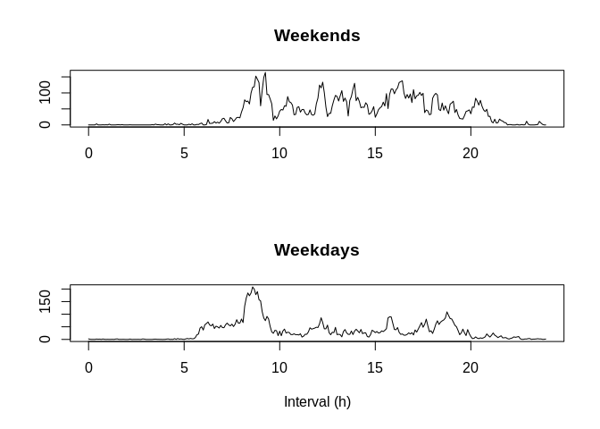

#### Author: Fernando Duarte Salhani
#### Date: 2019-11-09
#### Course: Reproducible Research
#### Coursera Data Science Specialization

## Loading and preprocessing the data

First, let's load the dataset from the zip file in this repository.

```r
unzip(zipfile = "activity.zip", files = "activity.csv", overwrite = TRUE)

activity <- read.csv("activity.csv")

head(activity)
```

```
##   steps       date interval
## 1    NA 2012-10-01        0
## 2    NA 2012-10-01        5
## 3    NA 2012-10-01       10
## 4    NA 2012-10-01       15
## 5    NA 2012-10-01       20
## 6    NA 2012-10-01       25
```


```r
summary(activity)
```

```
##      steps                date          interval     
##  Min.   :  0.00   2012-10-01:  288   Min.   :   0.0  
##  1st Qu.:  0.00   2012-10-02:  288   1st Qu.: 588.8  
##  Median :  0.00   2012-10-03:  288   Median :1177.5  
##  Mean   : 37.38   2012-10-04:  288   Mean   :1177.5  
##  3rd Qu.: 12.00   2012-10-05:  288   3rd Qu.:1766.2  
##  Max.   :806.00   2012-10-06:  288   Max.   :2355.0  
##  NA's   :2304     (Other)   :15840
```

## What is mean total number of steps taken per day?

Create an aggregation of the data which contains the number of steps per day. As nothing has been done to missing values so far, just ignore NA's for now

```r
by_day <- aggregate(activity$steps, by = list(activity$date), FUN = sum, na.rm = TRUE)

names(by_day) <- c("date", "steps")

head(by_day)
```

```
##         date steps
## 1 2012-10-01     0
## 2 2012-10-02   126
## 3 2012-10-03 11352
## 4 2012-10-04 12116
## 5 2012-10-05 13294
## 6 2012-10-06 15420
```

Now, plot a histogram of the aggregated data

```r
hist(by_day$steps, breaks = 10, col = "blue", xlab = "Steps", main = "Number of steps taken per day")
```

<!-- -->

To get the mean and median values, simply apply the `mean` and `median` functions to the series

```r
print(paste("The mean of total steps per day is ", mean(by_day$steps)))
```

```
## [1] "The mean of total steps per day is  9354.22950819672"
```

```r
print(paste("The median of total steps per day is ", median(by_day$steps)))
```

```
## [1] "The median of total steps per day is  10395"
```

## What is the average daily activity pattern?

To get the number of steps taken in each 5-minute interval, aggregate the data by interval using the `mean` function

```r
by_interval <- aggregate(activity$steps, by = list(activity$interval), FUN = mean, na.rm = TRUE)

names(by_interval) <- c("interval", "steps")

head(by_interval)
```

```
##   interval     steps
## 1        0 1.7169811
## 2        5 0.3396226
## 3       10 0.1320755
## 4       15 0.1509434
## 5       20 0.0754717
## 6       25 2.0943396
```

To plot the data, it is useful to first turn the intervals into a continuous version of itself *(the way it is presented, the intervals jump from &ast;55 to &ast;00)*

```r
continuous_hours <- by_interval$interval %/% 100 + by_interval$interval %% 100 / 60

plot(x = continuous_hours, y = by_interval$steps, type = "l", main = "Average steps per interval", xlab = "Interval (h)", ylab = "Average steps taken")
```

<!-- -->


```r
most_steps <- by_interval[which.max(by_interval$steps), "interval"]
most_steps_hour <- most_steps %/% 100
most_steps_minutes <- most_steps %% 100

print(paste("The 5-minute interval with the most steps taken was ", most_steps_hour, "h", most_steps_minutes, sep = ""))
```

```
## [1] "The 5-minute interval with the most steps taken was 8h35"
```

## Imputing missing values

First, let's see how many missing values we have:

```r
sum(is.na(activity$steps))
```

```
## [1] 2304
```

There are 2304 missing values out of the 17568 observations. To input missing values, the logic used will be the following:

- Take the median of steps for that interval in that day of the week
- Replace NA's with that median


```r
dow_interval <- aggregate(activity$steps, by = list(activity$interval, weekdays(as.Date(activity$date))), FUN = median, na.rm = TRUE)

names(dow_interval) <- c("interval", "dow", "steps")

df <- cbind(activity)

df$dow <- weekdays(as.Date(df$date))

df <- merge(df, dow_interval, by = c("dow", "interval"), suffixes = c('', '_new'))

df$steps[is.na(df$steps)] <- as.integer(df$steps_new[is.na(df$steps)])
```

Now let's aggregate the data once more

```r
daily_steps <- aggregate(df$steps, by = list(df$date), FUN = sum)

names(daily_steps) <- c("date", "steps")

head(daily_steps)
```

```
##         date steps
## 1 2012-10-01  2073
## 2 2012-10-02   126
## 3 2012-10-03 11352
## 4 2012-10-04 12116
## 5 2012-10-05 13294
## 6 2012-10-06 15420
```

Then plot the histogram the same way we did before

```r
hist(daily_steps$steps, breaks = 10, col = "blue", xlab = "Steps", main = "Number of steps taken per day")
```

<!-- -->

Then get the mean and median

```r
print(paste("The mean of total steps per day is ", mean(daily_steps$steps)))
```

```
## [1] "The mean of total steps per day is  9704.65573770492"
```

```r
print(paste("The median of total steps per day is ", median(daily_steps$steps)))
```

```
## [1] "The median of total steps per day is  10395"
```

From this, we could see a slight change to the mean after filling the missing values, but the median remained the same. The histogram, however, was clearly different from the removal of NA's, even if the overall shape was similar.

## Are there differences in activity patterns between weekdays and weekends?

To check if the activity is different on the weekends, it is useful to create a variable that assigns each row to weekday or weekend

```r
df$weekend <- df$dow == "Saturday" | df$dow == "Sunday"
```

Then we can create the plots of the variables per interval for each segmentation

```r
weekend_intervals <- aggregate(df$steps[df$weekend], by = list(df$interval[df$weekend]), FUN = mean)

names(weekend_intervals) <- c("interval", "steps")

weekday_intervals <- aggregate(df$steps[!df$weekend], by = list(df$interval[!df$weekend]), FUN = mean)

names(weekday_intervals) <- c("interval", "steps")

par(mfrow = c(2,1))

continuous_hours <- weekend_intervals$interval %/% 100 + by_interval$interval %% 100 / 60

plot(x = continuous_hours, y = weekend_intervals$steps, type = "l", main = "Weekends", xlab = "", ylab = "")

continuous_hours <- weekday_intervals$interval %/% 100 + by_interval$interval %% 100 / 60

plot(x = continuous_hours, y = weekday_intervals$steps, type = "l", main = "Weekdays", xlab = "Interval (h)", ylab = "")
```

<!-- -->

